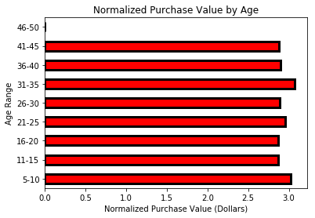
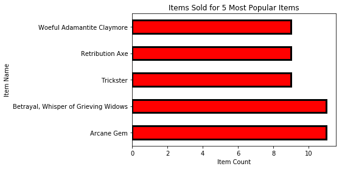

# Heroes of Pymoli Analysis

1. There are 573 active players with males holding the majority market share of 81.15%.  Each player bought on average 1.36 items with the top spender buying 5 Items.
2. The total revenue is 2286.33 Dollars.
3. Males represent a purchase value of 1867.68 Dollars wile females represent a purchase value of 382.91 Dollars.
4. The largest purchase counts by age group was the 21-25 age range followed by the 16-20 age range.
5. The total purchase value of the 21-25 age range was 902.61 Dollars and 16-20 age range was 528.74 Dollars.
6. These two age ranges represent 62.6 Percent of the total revenue.
7. The most popular Item was purchased only 11 times compared to 780 total purchases
8. The 5 most popular items had a combined total purchase value of 117.43 Dollars.
9. The 5 most profitable Items had a combined total purchase value of 154.81 Dollars with the most profitable item bringing in 37.26 Dollars.

## Recomendations:

1. Individual players do not represent significant revenue generators with the max purchase value of a single player being only 17.06 Dollars.  The biggest way to increase revenue is to increase the number of players.
2. The gender demographics are overwhelmingly male.  I recommend a Marketting campaign targeted at attracting the large female gamer population.
3. The 26-30 and 31-35 age range represent a smaller proportion of the total player demographic however this is still a large gaming population.  A targeted marketing campaign should be able to increase this population.
4. While increasing the number of players may be the best way increaase revenue, increasing the in game incentive to purchase items is also an important consideration.
5. Individual Items do not represent significant revenue generators.  Rather revenue is contained in the variety of items to atract different interest.  I suggest a study to determine the ROI of adding more variety of items to increase revenue.  


```python
import pandas as pd
import matplotlib.pyplot as plt
import numpy as np
```


```python
path = 'purchase_data.json'
purchase_data_df = pd.read_json(path)
purchase_data_df.head()
```


<div>
<style scoped>
    .dataframe tbody tr th:only-of-type {
        vertical-align: middle;
    }

    .dataframe tbody tr th {
        vertical-align: top;
    }

    .dataframe thead th {
        text-align: right;
    }
</style>
<table border="1" class="dataframe">
  <thead>
    <tr style="text-align: right;">
      <th></th>
      <th>Age</th>
      <th>Gender</th>
      <th>Item ID</th>
      <th>Item Name</th>
      <th>Price</th>
      <th>SN</th>
    </tr>
  </thead>
  <tbody>
    <tr>
      <th>0</th>
      <td>38</td>
      <td>Male</td>
      <td>165</td>
      <td>Bone Crushing Silver Skewer</td>
      <td>3.37</td>
      <td>Aelalis34</td>
    </tr>
    <tr>
      <th>1</th>
      <td>21</td>
      <td>Male</td>
      <td>119</td>
      <td>Stormbringer, Dark Blade of Ending Misery</td>
      <td>2.32</td>
      <td>Eolo46</td>
    </tr>
    <tr>
      <th>2</th>
      <td>34</td>
      <td>Male</td>
      <td>174</td>
      <td>Primitive Blade</td>
      <td>2.46</td>
      <td>Assastnya25</td>
    </tr>
    <tr>
      <th>3</th>
      <td>21</td>
      <td>Male</td>
      <td>92</td>
      <td>Final Critic</td>
      <td>1.36</td>
      <td>Pheusrical25</td>
    </tr>
    <tr>
      <th>4</th>
      <td>23</td>
      <td>Male</td>
      <td>63</td>
      <td>Stormfury Mace</td>
      <td>1.27</td>
      <td>Aela59</td>
    </tr>
  </tbody>
</table>
</div>


```python
num_players = len(purchase_data_df['SN'].unique())
num_players
```


    573


```python
unique_items = len(purchase_data_df['Item ID'].unique())
unique_items
```


    183


```python
avg_purchase_price = round(purchase_data_df['Price'].mean(), 2)
avg_purchase_price
```


    2.93


```python
num_purchases = purchase_data_df['Price'].size
num_purchases
```


    780


```python
tot_revenue = purchase_data_df['Price'].sum()
tot_revenue
```


    2286.33


# Gender Demographics:


## What I need to know:

1. percentage and count of Male
2. percentage and count of Female
3. percentage and count of other / Non-Disclosed

## what I know:

1. there are more than one representation of some but not all players. the max representation is 5 times.
2. Collumn Gender contains the information needed however it has duplicates.
3. there are 573 unique players.
4. there are 780 rows in the dataframe.

## what I need to do:

1. drop the rows with duplicate players.
2. make new dataframe
3. groupby Gender
4. count gender groups
5. divide counts by total number of players to get percentages.


```python
dropped_duplicate_SN = purchase_data_df.drop_duplicates(subset='SN',keep='first')
gender_grouped_df = dropped_duplicate_SN.groupby('Gender').count()
gender_renamed = gender_grouped_df.rename(index=str, columns={'Age': 'Gender Count', 'Item ID': 'Gender Percentage'})
gender_renamed['Gender Percentage'] = round((gender_renamed.loc[:,'Gender Percentage'] / num_players) * 100, 2)
gender_count = gender_renamed.loc[:, ['Gender Count', 'Gender Percentage']]
gender_count
```


<div>
<style scoped>
    .dataframe tbody tr th:only-of-type {
        vertical-align: middle;
    }

    .dataframe tbody tr th {
        vertical-align: top;
    }

    .dataframe thead th {
        text-align: right;
    }
</style>
<table border="1" class="dataframe">
  <thead>
    <tr style="text-align: right;">
      <th></th>
      <th>Gender Count</th>
      <th>Gender Percentage</th>
    </tr>
    <tr>
      <th>Gender</th>
      <th></th>
      <th></th>
    </tr>
  </thead>
  <tbody>
    <tr>
      <th>Female</th>
      <td>100</td>
      <td>17.45</td>
    </tr>
    <tr>
      <th>Male</th>
      <td>465</td>
      <td>81.15</td>
    </tr>
    <tr>
      <th>Other / Non-Disclosed</th>
      <td>8</td>
      <td>1.40</td>
    </tr>
  </tbody>
</table>
</div>


# Gender Count:


```python
ax = plt.subplot()
gender_count['Gender Count'].plot(kind='pie', legend=False, ax=ax, shadow=True, explode=(0.1, 0.1, 0.1), colors=['pink', 'skyblue', 'lightgreen'])
ax.set_title('Gender Count')
ax.set_ylabel('')
```


    Text(0,0.5,'')


# Gender Percentages


```python
ax1 = plt.subplot()
gender_count['Gender Percentage'].plot(kind='pie', legend=False, ax=ax1, shadow=True, explode=(0.1, 0.1, 0.1), colors=['pink', 'skyblue', 'lightgreen'])
ax1.set_title('Gender Percentage')
ax1.set_ylabel('')
```


    Text(0,0.5,'')


```python
gender_groupby = purchase_data_df.groupby('Gender')
```

# Purchase Count by Gender:


```python
count_df = gender_groupby.count()
count = count_df.loc[:,'Age']
purchase_count_df = count.to_frame()
purchase_count_df = purchase_count_df.rename(index=str, columns={'Age': 'Purchase Count'})
purchase_count_df
#purchase_count_df = count_df(index=str, columns={'Age': 'Purchase Count'})
```


<div>
<style scoped>
    .dataframe tbody tr th:only-of-type {
        vertical-align: middle;
    }

    .dataframe tbody tr th {
        vertical-align: top;
    }

    .dataframe thead th {
        text-align: right;
    }
</style>
<table border="1" class="dataframe">
  <thead>
    <tr style="text-align: right;">
      <th></th>
      <th>Purchase Count</th>
    </tr>
    <tr>
      <th>Gender</th>
      <th></th>
    </tr>
  </thead>
  <tbody>
    <tr>
      <th>Female</th>
      <td>136</td>
    </tr>
    <tr>
      <th>Male</th>
      <td>633</td>
    </tr>
    <tr>
      <th>Other / Non-Disclosed</th>
      <td>11</td>
    </tr>
  </tbody>
</table>
</div>


```python
ax2 = plt.subplot()
purchase_count_df['Purchase Count'].plot(kind='pie', legend=False, ax=ax2, shadow=True, explode=(0.1, 0.1, 0.1), colors=['pink', 'skyblue', 'lightgreen'])
ax2.set_title('Purchase Count')
ax2.set_ylabel('')
```


    Text(0,0.5,'')


# Average Price by Gender:


```python
avg_df = gender_groupby.mean()
avg = avg_df.loc[:,'Price']
avg_price_df = avg.to_frame()
avg_price_df = avg_price_df.rename(index=str, columns={'Price': 'Avg Purchase Price'})
avg_price_df
```


<div>
<style scoped>
    .dataframe tbody tr th:only-of-type {
        vertical-align: middle;
    }

    .dataframe tbody tr th {
        vertical-align: top;
    }

    .dataframe thead th {
        text-align: right;
    }
</style>
<table border="1" class="dataframe">
  <thead>
    <tr style="text-align: right;">
      <th></th>
      <th>Avg Purchase Price</th>
    </tr>
    <tr>
      <th>Gender</th>
      <th></th>
    </tr>
  </thead>
  <tbody>
    <tr>
      <th>Female</th>
      <td>2.815515</td>
    </tr>
    <tr>
      <th>Male</th>
      <td>2.950521</td>
    </tr>
    <tr>
      <th>Other / Non-Disclosed</th>
      <td>3.249091</td>
    </tr>
  </tbody>
</table>
</div>


```python
ax3 = plt.subplot()
avg_price_df.plot(kind='barh', legend=False, ax=ax3, color='r', edgecolor='k', linewidth=3)
ax3.set_xlabel('Average Price (Dollars)')
ax3.set_title('Average Price of Items by Gender')
```


    Text(0.5,1,'Average Price of Items by Gender')


# Total Purchase Value by Gender:


```python
total_df = gender_groupby.sum()
total = total_df.loc[:,'Price']
total_price_df = total.to_frame()
total_price_df = total_price_df.rename(index=str, columns={'Price': 'Total Purchase Value'})
total_price_df
```


<div>
<style scoped>
    .dataframe tbody tr th:only-of-type {
        vertical-align: middle;
    }

    .dataframe tbody tr th {
        vertical-align: top;
    }

    .dataframe thead th {
        text-align: right;
    }
</style>
<table border="1" class="dataframe">
  <thead>
    <tr style="text-align: right;">
      <th></th>
      <th>Total Purchase Value</th>
    </tr>
    <tr>
      <th>Gender</th>
      <th></th>
    </tr>
  </thead>
  <tbody>
    <tr>
      <th>Female</th>
      <td>382.91</td>
    </tr>
    <tr>
      <th>Male</th>
      <td>1867.68</td>
    </tr>
    <tr>
      <th>Other / Non-Disclosed</th>
      <td>35.74</td>
    </tr>
  </tbody>
</table>
</div>


```python
ax4 = plt.subplot()
total_price_df.plot(kind='barh', legend=False, ax=ax4, color='r', edgecolor='k', linewidth=3)
ax4.set_xlabel('Total Purchase Value (Dollars)')
ax4.set_title('Total Purchase Value by Gender')
```


    Text(0.5,1,'Total Purchase Value by Gender')


# Normalized Totals by Gender:


```python
normalized_price_df = total_price_df.assign()
normalized_price_df.iloc[0,0] = normalized_price_df.iloc[0,0] / purchase_count_df.iloc[0,0]
normalized_price_df.iloc[1,0] = normalized_price_df.iloc[1,0] / purchase_count_df.iloc[1,0]
normalized_price_df.iloc[2,0] = normalized_price_df.iloc[2,0] / purchase_count_df.iloc[2,0]
normalized_price_df.rename(index=str, columns={'Total Purchase Value': 'Normalized Purchase Value'}, inplace=True)
normalized_price_df
```


<div>
<style scoped>
    .dataframe tbody tr th:only-of-type {
        vertical-align: middle;
    }

    .dataframe tbody tr th {
        vertical-align: top;
    }

    .dataframe thead th {
        text-align: right;
    }
</style>
<table border="1" class="dataframe">
  <thead>
    <tr style="text-align: right;">
      <th></th>
      <th>Normalized Purchase Value</th>
    </tr>
    <tr>
      <th>Gender</th>
      <th></th>
    </tr>
  </thead>
  <tbody>
    <tr>
      <th>Female</th>
      <td>2.815515</td>
    </tr>
    <tr>
      <th>Male</th>
      <td>2.950521</td>
    </tr>
    <tr>
      <th>Other / Non-Disclosed</th>
      <td>3.249091</td>
    </tr>
  </tbody>
</table>
</div>


# Age Demographics:

# Age Data Binning:

1. Age data is binned into 9 bins
2. bins are: (5,10], (10,15], (15,20], (20,25], (25,30], (30,35], (35,40], (40,45], (45,50]
3. Age bins are assigned label and added to the column 'Age Range'


```python
print(purchase_data_df['Age'].min())
bin = np.arange(5,55,5)
labels = ['5-10', '11-15', '16-20', '21-25', '26-30', '31-35', '36-40', '41-45','46-50']
purchase_data_df['Age Range'] = pd.cut(purchase_data_df['Age'], bin, labels=labels) 
purchase_data_df.sort_values('Age', ascending=False).head(10)

```

    7


<div>
<style scoped>
    .dataframe tbody tr th:only-of-type {
        vertical-align: middle;
    }

    .dataframe tbody tr th {
        vertical-align: top;
    }

    .dataframe thead th {
        text-align: right;
    }
</style>
<table border="1" class="dataframe">
  <thead>
    <tr style="text-align: right;">
      <th></th>
      <th>Age</th>
      <th>Gender</th>
      <th>Item ID</th>
      <th>Item Name</th>
      <th>Price</th>
      <th>SN</th>
      <th>Age Range</th>
    </tr>
  </thead>
  <tbody>
    <tr>
      <th>264</th>
      <td>45</td>
      <td>Male</td>
      <td>124</td>
      <td>Venom Claymore</td>
      <td>2.72</td>
      <td>Marassaya49</td>
      <td>41-45</td>
    </tr>
    <tr>
      <th>644</th>
      <td>43</td>
      <td>Male</td>
      <td>57</td>
      <td>Despair, Favor of Due Diligence</td>
      <td>3.81</td>
      <td>Raesurdil91</td>
      <td>41-45</td>
    </tr>
    <tr>
      <th>319</th>
      <td>42</td>
      <td>Male</td>
      <td>110</td>
      <td>Suspension</td>
      <td>2.11</td>
      <td>Lisista27</td>
      <td>41-45</td>
    </tr>
    <tr>
      <th>212</th>
      <td>40</td>
      <td>Male</td>
      <td>111</td>
      <td>Misery's End</td>
      <td>2.91</td>
      <td>Yarmol79</td>
      <td>36-40</td>
    </tr>
    <tr>
      <th>478</th>
      <td>40</td>
      <td>Male</td>
      <td>168</td>
      <td>Sun Strike, Jaws of Twisted Visions</td>
      <td>2.64</td>
      <td>Yaralnura48</td>
      <td>36-40</td>
    </tr>
    <tr>
      <th>14</th>
      <td>40</td>
      <td>Male</td>
      <td>44</td>
      <td>Bonecarvin Battle Axe</td>
      <td>2.46</td>
      <td>Sundast29</td>
      <td>36-40</td>
    </tr>
    <tr>
      <th>179</th>
      <td>40</td>
      <td>Male</td>
      <td>70</td>
      <td>Hope's End</td>
      <td>3.89</td>
      <td>Chanosiaya39</td>
      <td>36-40</td>
    </tr>
    <tr>
      <th>357</th>
      <td>40</td>
      <td>Male</td>
      <td>65</td>
      <td>Conqueror Adamantite Mace</td>
      <td>1.96</td>
      <td>Sundast29</td>
      <td>36-40</td>
    </tr>
    <tr>
      <th>186</th>
      <td>40</td>
      <td>Male</td>
      <td>144</td>
      <td>Blood Infused Guardian</td>
      <td>2.86</td>
      <td>Chanosiaya39</td>
      <td>36-40</td>
    </tr>
    <tr>
      <th>238</th>
      <td>40</td>
      <td>Female</td>
      <td>49</td>
      <td>The Oculus, Token of Lost Worlds</td>
      <td>4.23</td>
      <td>Chamadar27</td>
      <td>36-40</td>
    </tr>
  </tbody>
</table>
</div>


# Grouping by Age Range:


```python
age_range_groupby = purchase_data_df.groupby('Age Range')
```

# Purchase Count by Age Range:


```python
age_range_count = age_range_groupby.count()
age_range_purchase_count = age_range_count['Item ID'].to_frame()
age_range_purchase_count = age_range_purchase_count.rename(index=str, columns={'Item ID': 'Purchase Count'})
age_range_purchase_count
```


<div>
<style scoped>
    .dataframe tbody tr th:only-of-type {
        vertical-align: middle;
    }

    .dataframe tbody tr th {
        vertical-align: top;
    }

    .dataframe thead th {
        text-align: right;
    }
</style>
<table border="1" class="dataframe">
  <thead>
    <tr style="text-align: right;">
      <th></th>
      <th>Purchase Count</th>
    </tr>
    <tr>
      <th>Age Range</th>
      <th></th>
    </tr>
  </thead>
  <tbody>
    <tr>
      <th>5-10</th>
      <td>32</td>
    </tr>
    <tr>
      <th>11-15</th>
      <td>78</td>
    </tr>
    <tr>
      <th>16-20</th>
      <td>184</td>
    </tr>
    <tr>
      <th>21-25</th>
      <td>305</td>
    </tr>
    <tr>
      <th>26-30</th>
      <td>76</td>
    </tr>
    <tr>
      <th>31-35</th>
      <td>58</td>
    </tr>
    <tr>
      <th>36-40</th>
      <td>44</td>
    </tr>
    <tr>
      <th>41-45</th>
      <td>3</td>
    </tr>
    <tr>
      <th>46-50</th>
      <td>0</td>
    </tr>
  </tbody>
</table>
</div>


```python
ax5 = plt.subplot()
age_range_purchase_count['Purchase Count'].plot(kind='pie', ax=ax5, explode=(0.1,0.1,0.1,0.1,0.1,0.1,0.1,0.1,0.1))
ax5.set_title('Purchase Count by Age Range')
ax5.set_ylabel('')
```


    Text(0,0.5,'')


# Average Purchase Price by Age Range:


```python
age_range_avg = age_range_groupby.mean()
age_range_avg_price = age_range_avg['Price'].to_frame()
age_range_avg_price = age_range_avg_price.rename(index=str, columns={'Price':'Average Purchase Price'})
age_range_avg_price
```


<div>
<style scoped>
    .dataframe tbody tr th:only-of-type {
        vertical-align: middle;
    }

    .dataframe tbody tr th {
        vertical-align: top;
    }

    .dataframe thead th {
        text-align: right;
    }
</style>
<table border="1" class="dataframe">
  <thead>
    <tr style="text-align: right;">
      <th></th>
      <th>Average Purchase Price</th>
    </tr>
    <tr>
      <th>Age Range</th>
      <th></th>
    </tr>
  </thead>
  <tbody>
    <tr>
      <th>5-10</th>
      <td>3.019375</td>
    </tr>
    <tr>
      <th>11-15</th>
      <td>2.873718</td>
    </tr>
    <tr>
      <th>16-20</th>
      <td>2.873587</td>
    </tr>
    <tr>
      <th>21-25</th>
      <td>2.959377</td>
    </tr>
    <tr>
      <th>26-30</th>
      <td>2.892368</td>
    </tr>
    <tr>
      <th>31-35</th>
      <td>3.073448</td>
    </tr>
    <tr>
      <th>36-40</th>
      <td>2.897500</td>
    </tr>
    <tr>
      <th>41-45</th>
      <td>2.880000</td>
    </tr>
    <tr>
      <th>46-50</th>
      <td>NaN</td>
    </tr>
  </tbody>
</table>
</div>


```python
ax6 = plt.subplot()
age_range_avg_price.plot(kind='barh', legend=False, ax=ax6, color='r', edgecolor='k', linewidth=3)
ax6.set_xlabel('Avergage Purchase Price')
ax6.set_title('Average Purchase Price by Age Range')
```


    Text(0.5,1,'Average Purchase Price by Age Range')


# Total Purchase Value by Age Range:


```python
age_range_sum = age_range_groupby.sum()
age_range_tot_value = age_range_sum['Price'].to_frame()
age_range_tot_value = age_range_tot_value.rename(index=str, columns={'Price':'Total Purchase Value'})
age_range_tot_value
```


<div>
<style scoped>
    .dataframe tbody tr th:only-of-type {
        vertical-align: middle;
    }

    .dataframe tbody tr th {
        vertical-align: top;
    }

    .dataframe thead th {
        text-align: right;
    }
</style>
<table border="1" class="dataframe">
  <thead>
    <tr style="text-align: right;">
      <th></th>
      <th>Total Purchase Value</th>
    </tr>
    <tr>
      <th>Age Range</th>
      <th></th>
    </tr>
  </thead>
  <tbody>
    <tr>
      <th>5-10</th>
      <td>96.62</td>
    </tr>
    <tr>
      <th>11-15</th>
      <td>224.15</td>
    </tr>
    <tr>
      <th>16-20</th>
      <td>528.74</td>
    </tr>
    <tr>
      <th>21-25</th>
      <td>902.61</td>
    </tr>
    <tr>
      <th>26-30</th>
      <td>219.82</td>
    </tr>
    <tr>
      <th>31-35</th>
      <td>178.26</td>
    </tr>
    <tr>
      <th>36-40</th>
      <td>127.49</td>
    </tr>
    <tr>
      <th>41-45</th>
      <td>8.64</td>
    </tr>
    <tr>
      <th>46-50</th>
      <td>0.00</td>
    </tr>
  </tbody>
</table>
</div>


```python
ax7 = plt.subplot()
age_range_tot_value.plot(kind='Barh', legend=False, ax=ax7, color='r', edgecolor='k', linewidth=3)
ax7.set_xlabel('Total Purchase Value (Dollars)')
ax7.set_title('Total Purchase Value by Age Range')
```


    Text(0.5,1,'Total Purchase Value by Age Range')


# Normalized Total Purchase Value by Age Range:


```python
age_normalized_tot = age_range_tot_value.assign()
for i in range(len(labels)):
    age_normalized_tot.iloc[i,0] = age_normalized_tot.iloc[i,0] / age_range_purchase_count.iloc[i,0]
age_normalized_tot.rename(index=str, columns={'Total Purchase Value': 'Normalized Purchase Value'}, inplace=True)
age_normalized_tot
```

    /anaconda3/envs/PythonData/lib/python3.6/site-packages/ipykernel_launcher.py:3: RuntimeWarning: invalid value encountered in double_scalars
      This is separate from the ipykernel package so we can avoid doing imports until


<div>
<style scoped>
    .dataframe tbody tr th:only-of-type {
        vertical-align: middle;
    }

    .dataframe tbody tr th {
        vertical-align: top;
    }

    .dataframe thead th {
        text-align: right;
    }
</style>
<table border="1" class="dataframe">
  <thead>
    <tr style="text-align: right;">
      <th></th>
      <th>Normalized Purchase Value</th>
    </tr>
    <tr>
      <th>Age Range</th>
      <th></th>
    </tr>
  </thead>
  <tbody>
    <tr>
      <th>5-10</th>
      <td>3.019375</td>
    </tr>
    <tr>
      <th>11-15</th>
      <td>2.873718</td>
    </tr>
    <tr>
      <th>16-20</th>
      <td>2.873587</td>
    </tr>
    <tr>
      <th>21-25</th>
      <td>2.959377</td>
    </tr>
    <tr>
      <th>26-30</th>
      <td>2.892368</td>
    </tr>
    <tr>
      <th>31-35</th>
      <td>3.073448</td>
    </tr>
    <tr>
      <th>36-40</th>
      <td>2.897500</td>
    </tr>
    <tr>
      <th>41-45</th>
      <td>2.880000</td>
    </tr>
    <tr>
      <th>46-50</th>
      <td>NaN</td>
    </tr>
  </tbody>
</table>
</div>


```python
ax8 = plt.subplot()
age_normalized_tot.plot(kind='Barh', legend=False, ax=ax8, color='r', edgecolor='k', linewidth=3)
ax8.set_title('Normalized Purchase Value by Age')
ax8.set_xlabel("Normalized Purchase Value (Dollars)")
```


    Text(0.5,0,'Normalized Purchase Value (Dollars)')





# Top 5 Spenders:


```python


top_spenders = purchase_data_df.groupby('SN').sum().sort_values('Price', ascending=False)
top_spenders = top_spenders.iloc[0:5,2].to_frame().rename(index=str, columns={'Price': 'Total Purchase Value'})
```


```python
top_spenders_index = list(top_spenders.index)
top_spenders_index
```


    ['Undirrala66', 'Saedue76', 'Mindimnya67', 'Haellysu29', 'Eoda93']


```python
top_purchase_data_df = purchase_data_df.set_index('SN')
top_purchase_data_df = top_purchase_data_df.loc[top_spenders_index,:]
top_purchase_data_df = top_purchase_data_df.reset_index()
top_purchase_groupby = top_purchase_data_df.groupby('SN')
```

## Number of Items Purchased:


```python
top_purchase_count =top_purchase_groupby.count()
top_purchase_item_count = top_purchase_count['Item ID'].to_frame()
top_purchase_item_count.rename(index=str, columns={'Item ID': 'Items Purchased'}, inplace=True)
top_purchase_item_count
```


<div>
<style scoped>
    .dataframe tbody tr th:only-of-type {
        vertical-align: middle;
    }

    .dataframe tbody tr th {
        vertical-align: top;
    }

    .dataframe thead th {
        text-align: right;
    }
</style>
<table border="1" class="dataframe">
  <thead>
    <tr style="text-align: right;">
      <th></th>
      <th>Items Purchased</th>
    </tr>
    <tr>
      <th>SN</th>
      <th></th>
    </tr>
  </thead>
  <tbody>
    <tr>
      <th>Eoda93</th>
      <td>3</td>
    </tr>
    <tr>
      <th>Haellysu29</th>
      <td>3</td>
    </tr>
    <tr>
      <th>Mindimnya67</th>
      <td>4</td>
    </tr>
    <tr>
      <th>Saedue76</th>
      <td>4</td>
    </tr>
    <tr>
      <th>Undirrala66</th>
      <td>5</td>
    </tr>
  </tbody>
</table>
</div>


## Average Price of Items Purchased:


```python
top_purchase_avg =top_purchase_groupby.mean()
top_purchase_avg_price = top_purchase_avg['Price'].to_frame()
top_purchase_avg_price.rename(index=str, columns={'Price': 'Average Price Purchased'}, inplace=True)
top_purchase_avg_price
```


<div>
<style scoped>
    .dataframe tbody tr th:only-of-type {
        vertical-align: middle;
    }

    .dataframe tbody tr th {
        vertical-align: top;
    }

    .dataframe thead th {
        text-align: right;
    }
</style>
<table border="1" class="dataframe">
  <thead>
    <tr style="text-align: right;">
      <th></th>
      <th>Average Price Purchased</th>
    </tr>
    <tr>
      <th>SN</th>
      <th></th>
    </tr>
  </thead>
  <tbody>
    <tr>
      <th>Eoda93</th>
      <td>3.860000</td>
    </tr>
    <tr>
      <th>Haellysu29</th>
      <td>4.243333</td>
    </tr>
    <tr>
      <th>Mindimnya67</th>
      <td>3.185000</td>
    </tr>
    <tr>
      <th>Saedue76</th>
      <td>3.390000</td>
    </tr>
    <tr>
      <th>Undirrala66</th>
      <td>3.412000</td>
    </tr>
  </tbody>
</table>
</div>


## Total Purchase Value of Top Spenders:


```python
top_purchase_sum =top_purchase_groupby.sum()
top_purchase_tot_price = top_purchase_sum['Price'].to_frame()
top_purchase_tot_price.rename(index=str, columns={'Price': 'Total Purchased Value'}, inplace=True)
top_purchase_tot_price
```


<div>
<style scoped>
    .dataframe tbody tr th:only-of-type {
        vertical-align: middle;
    }

    .dataframe tbody tr th {
        vertical-align: top;
    }

    .dataframe thead th {
        text-align: right;
    }
</style>
<table border="1" class="dataframe">
  <thead>
    <tr style="text-align: right;">
      <th></th>
      <th>Total Purchased Value</th>
    </tr>
    <tr>
      <th>SN</th>
      <th></th>
    </tr>
  </thead>
  <tbody>
    <tr>
      <th>Eoda93</th>
      <td>11.58</td>
    </tr>
    <tr>
      <th>Haellysu29</th>
      <td>12.73</td>
    </tr>
    <tr>
      <th>Mindimnya67</th>
      <td>12.74</td>
    </tr>
    <tr>
      <th>Saedue76</th>
      <td>13.56</td>
    </tr>
    <tr>
      <th>Undirrala66</th>
      <td>17.06</td>
    </tr>
  </tbody>
</table>
</div>


```python
top_spenders_df = top_purchase_tot_price.reset_index().merge(top_purchase_avg_price.reset_index()).merge(top_purchase_item_count.reset_index())
```

## Summary Table:


```python
top_spenders_df = top_spenders_df.sort_values('Total Purchased Value', ascending=False)
top_spenders_df
```


<div>
<style scoped>
    .dataframe tbody tr th:only-of-type {
        vertical-align: middle;
    }

    .dataframe tbody tr th {
        vertical-align: top;
    }

    .dataframe thead th {
        text-align: right;
    }
</style>
<table border="1" class="dataframe">
  <thead>
    <tr style="text-align: right;">
      <th></th>
      <th>SN</th>
      <th>Total Purchased Value</th>
      <th>Average Price Purchased</th>
      <th>Items Purchased</th>
    </tr>
  </thead>
  <tbody>
    <tr>
      <th>4</th>
      <td>Undirrala66</td>
      <td>17.06</td>
      <td>3.412000</td>
      <td>5</td>
    </tr>
    <tr>
      <th>3</th>
      <td>Saedue76</td>
      <td>13.56</td>
      <td>3.390000</td>
      <td>4</td>
    </tr>
    <tr>
      <th>2</th>
      <td>Mindimnya67</td>
      <td>12.74</td>
      <td>3.185000</td>
      <td>4</td>
    </tr>
    <tr>
      <th>1</th>
      <td>Haellysu29</td>
      <td>12.73</td>
      <td>4.243333</td>
      <td>3</td>
    </tr>
    <tr>
      <th>0</th>
      <td>Eoda93</td>
      <td>11.58</td>
      <td>3.860000</td>
      <td>3</td>
    </tr>
  </tbody>
</table>
</div>


```python
plt_top_spenders = top_spenders_df.set_index('SN')
```

## Value Plots:


```python
ax9 = plt.subplot()
plt_top_spenders['Items Purchased'].plot(kind='barh', ax=ax9, color='r', edgecolor='k', linewidth=3)
ax9.set_title('Number of Items Purchased by the 5 Top Spenders')
ax9.set_xlabel('Item Count')
ax9.set_ylabel('Screen Name')
```


    Text(0,0.5,'Screen Name')


```python
ax10 = plt.subplot()
plt_top_spenders['Average Price Purchased'].plot(kind='barh', ax=ax10, color='r', edgecolor='k', linewidth=3)
ax10.set_title('Average Price of Purchased Items for Top 5 Spenders')
ax10.set_xlabel('Average Price of Items (Dollars)')
ax10.set_ylabel('Screan Name')
```


    Text(0,0.5,'Screan Name')


```python
ax11 = plt.subplot()
plt_top_spenders['Total Purchased Value'].plot(kind='barh', ax=ax11, color='r', edgecolor='k', linewidth=3)
ax11.set_title('Total Purchased Value of Items for Top 5 Spenders')
ax11.set_xlabel('Total Purchased Value (Dollars)')
ax11.set_ylabel('Screan Name')
```


    Text(0,0.5,'Screan Name')


# Most Popular Items:

1. ID and Name of top 5 Items
2. Item Price
3. number of Items sold
4. Total Purchased Value


```python
pop_products = purchase_data_df['Item ID'].value_counts()
pop_products = pop_products.iloc[0:5].to_frame()
pop_products_index = pop_products.index
```


```python
purchase_data_ID = purchase_data_df.set_index('Item ID')
top_pop = purchase_data_ID.loc[pop_products_index,:]
top_name = top_pop['Item Name'].unique()
top_price = top_pop['Price'].unique()
top_products = pd.DataFrame({'Item ID': pop_products_index, 'Item Name': top_name, 'Price': top_price})
pop_products = pop_products.reset_index().rename(index=str, columns={'index': 'Item ID', 'Item ID': 'Item Count'})
top_products = top_products.merge(pop_products)
```

## Summary Chart:


```python
top_pop_group_sum = top_pop.groupby('Item Name').sum()
top_pop_tot_price = top_pop_group_sum['Price'].reset_index().rename(index=str, columns={'Price': 'Total Purchase Value'})
top_products = top_products.merge(top_pop_tot_price)
top_products
```


<div>
<style scoped>
    .dataframe tbody tr th:only-of-type {
        vertical-align: middle;
    }

    .dataframe tbody tr th {
        vertical-align: top;
    }

    .dataframe thead th {
        text-align: right;
    }
</style>
<table border="1" class="dataframe">
  <thead>
    <tr style="text-align: right;">
      <th></th>
      <th>Item ID</th>
      <th>Item Name</th>
      <th>Price</th>
      <th>Item Count</th>
      <th>Total Purchase Value</th>
    </tr>
  </thead>
  <tbody>
    <tr>
      <th>0</th>
      <td>84</td>
      <td>Arcane Gem</td>
      <td>2.23</td>
      <td>11</td>
      <td>24.53</td>
    </tr>
    <tr>
      <th>1</th>
      <td>39</td>
      <td>Betrayal, Whisper of Grieving Widows</td>
      <td>2.35</td>
      <td>11</td>
      <td>25.85</td>
    </tr>
    <tr>
      <th>2</th>
      <td>31</td>
      <td>Trickster</td>
      <td>2.07</td>
      <td>9</td>
      <td>18.63</td>
    </tr>
    <tr>
      <th>3</th>
      <td>34</td>
      <td>Retribution Axe</td>
      <td>4.14</td>
      <td>9</td>
      <td>37.26</td>
    </tr>
    <tr>
      <th>4</th>
      <td>175</td>
      <td>Woeful Adamantite Claymore</td>
      <td>1.24</td>
      <td>9</td>
      <td>11.16</td>
    </tr>
  </tbody>
</table>
</div>


## Plots of Values:


```python
ax12 = plt.subplot()
top_products.plot(x='Item Name', y='Item Count', kind='barh', ax=ax12, legend=False, color='r', edgecolor='k', linewidth=3)
ax12.set_xlabel('Item Count')
ax12.set_title('Items Sold for 5 Most Popular Items')
```


    Text(0.5,1,'Items Sold for 5 Most Popular Items')





```python
ax13 = plt.subplot()
top_products.plot(x='Item Name', y='Price', kind='barh', ax=ax13, legend=False, color='r', edgecolor='k', linewidth=3)
ax13.set_xlabel('Price (Dollars)')
ax13.set_title('Price of 5 Most Popular Items')
```


    Text(0.5,1,'Price of 5 Most Popular Items')


```python
ax14 = plt.subplot()
top_products.plot(x='Item Name', y='Total Purchase Value', kind='barh', ax=ax14, legend=False, color='r', edgecolor='k', linewidth=3)
ax14.set_xlabel('Total Purchase Value (Dollars)')
ax14.set_title('Total Purchase Value of 5 most Popular Items')
```


    Text(0.5,1,'Total Purchase Value of 5 most Popular Items')


# Most Profitable Items:

## Total Purchase Value of 5 most Profitable Items:


```python
items_df = purchase_data_df.assign()
items_df_tot_value = items_df.groupby('Item ID').sum()
top_items = items_df_tot_value.sort_values('Price',ascending=False).iloc[0:5,1].to_frame()
top_index =top_items.index
top_items.reset_index(inplace=True)
top_items.rename(index=str, columns={'Price': 'Total Purchase Value'}, inplace=True)
top_items
```


<div>
<style scoped>
    .dataframe tbody tr th:only-of-type {
        vertical-align: middle;
    }

    .dataframe tbody tr th {
        vertical-align: top;
    }

    .dataframe thead th {
        text-align: right;
    }
</style>
<table border="1" class="dataframe">
  <thead>
    <tr style="text-align: right;">
      <th></th>
      <th>Item ID</th>
      <th>Total Purchase Value</th>
    </tr>
  </thead>
  <tbody>
    <tr>
      <th>0</th>
      <td>34</td>
      <td>37.26</td>
    </tr>
    <tr>
      <th>1</th>
      <td>115</td>
      <td>29.75</td>
    </tr>
    <tr>
      <th>2</th>
      <td>32</td>
      <td>29.70</td>
    </tr>
    <tr>
      <th>3</th>
      <td>103</td>
      <td>29.22</td>
    </tr>
    <tr>
      <th>4</th>
      <td>107</td>
      <td>28.88</td>
    </tr>
  </tbody>
</table>
</div>


## Price of 5 Most Profitable Items:


```python
top_items_df = items_df.set_index('Item ID').loc[top_index,:]
top_items_price = top_items_df['Price'].unique()
top_items_price_df = pd.DataFrame({'Item ID': top_index, 'Price': top_items_price})
top_items_price_df
```


<div>
<style scoped>
    .dataframe tbody tr th:only-of-type {
        vertical-align: middle;
    }

    .dataframe tbody tr th {
        vertical-align: top;
    }

    .dataframe thead th {
        text-align: right;
    }
</style>
<table border="1" class="dataframe">
  <thead>
    <tr style="text-align: right;">
      <th></th>
      <th>Item ID</th>
      <th>Price</th>
    </tr>
  </thead>
  <tbody>
    <tr>
      <th>0</th>
      <td>34</td>
      <td>4.14</td>
    </tr>
    <tr>
      <th>1</th>
      <td>115</td>
      <td>4.25</td>
    </tr>
    <tr>
      <th>2</th>
      <td>32</td>
      <td>4.95</td>
    </tr>
    <tr>
      <th>3</th>
      <td>103</td>
      <td>4.87</td>
    </tr>
    <tr>
      <th>4</th>
      <td>107</td>
      <td>3.61</td>
    </tr>
  </tbody>
</table>
</div>


## Number of Items Sold for 5 Most Profitable Items:


```python
top_items_count = top_items_df.reset_index().groupby('Item ID').count()
top_items_count_df = top_items_count['SN'].to_frame().rename(index=str, columns={'SN': 'Item Count'})
top_items_count_df.reset_index(inplace=True)
top_items_count_df = top_items_count_df.astype('int64')
top_items_count_df
```


<div>
<style scoped>
    .dataframe tbody tr th:only-of-type {
        vertical-align: middle;
    }

    .dataframe tbody tr th {
        vertical-align: top;
    }

    .dataframe thead th {
        text-align: right;
    }
</style>
<table border="1" class="dataframe">
  <thead>
    <tr style="text-align: right;">
      <th></th>
      <th>Item ID</th>
      <th>Item Count</th>
    </tr>
  </thead>
  <tbody>
    <tr>
      <th>0</th>
      <td>32</td>
      <td>6</td>
    </tr>
    <tr>
      <th>1</th>
      <td>34</td>
      <td>9</td>
    </tr>
    <tr>
      <th>2</th>
      <td>103</td>
      <td>6</td>
    </tr>
    <tr>
      <th>3</th>
      <td>107</td>
      <td>8</td>
    </tr>
    <tr>
      <th>4</th>
      <td>115</td>
      <td>7</td>
    </tr>
  </tbody>
</table>
</div>


## Item Name and ID


```python
top_items_df = items_df.set_index('Item ID').loc[top_index,:]
top_items_name = top_items_df['Item Name'].unique()
top_items_name_df = pd.DataFrame({'Item ID': top_index, 'Item Name': top_items_name})
top_items_name_df
```


<div>
<style scoped>
    .dataframe tbody tr th:only-of-type {
        vertical-align: middle;
    }

    .dataframe tbody tr th {
        vertical-align: top;
    }

    .dataframe thead th {
        text-align: right;
    }
</style>
<table border="1" class="dataframe">
  <thead>
    <tr style="text-align: right;">
      <th></th>
      <th>Item ID</th>
      <th>Item Name</th>
    </tr>
  </thead>
  <tbody>
    <tr>
      <th>0</th>
      <td>34</td>
      <td>Retribution Axe</td>
    </tr>
    <tr>
      <th>1</th>
      <td>115</td>
      <td>Spectral Diamond Doomblade</td>
    </tr>
    <tr>
      <th>2</th>
      <td>32</td>
      <td>Orenmir</td>
    </tr>
    <tr>
      <th>3</th>
      <td>103</td>
      <td>Singed Scalpel</td>
    </tr>
    <tr>
      <th>4</th>
      <td>107</td>
      <td>Splitter, Foe Of Subtlety</td>
    </tr>
  </tbody>
</table>
</div>


## Summary Table


```python
most_profitable_items = top_items.merge(top_items_price_df)
most_profitable_items = most_profitable_items.merge(top_items_count_df, on='Item ID')
most_profitable_items = most_profitable_items.merge(top_items_name_df, on='Item ID')
most_profitable_items
```


<div>
<style scoped>
    .dataframe tbody tr th:only-of-type {
        vertical-align: middle;
    }

    .dataframe tbody tr th {
        vertical-align: top;
    }

    .dataframe thead th {
        text-align: right;
    }
</style>
<table border="1" class="dataframe">
  <thead>
    <tr style="text-align: right;">
      <th></th>
      <th>Item ID</th>
      <th>Total Purchase Value</th>
      <th>Price</th>
      <th>Item Count</th>
      <th>Item Name</th>
    </tr>
  </thead>
  <tbody>
    <tr>
      <th>0</th>
      <td>34</td>
      <td>37.26</td>
      <td>4.14</td>
      <td>9</td>
      <td>Retribution Axe</td>
    </tr>
    <tr>
      <th>1</th>
      <td>115</td>
      <td>29.75</td>
      <td>4.25</td>
      <td>7</td>
      <td>Spectral Diamond Doomblade</td>
    </tr>
    <tr>
      <th>2</th>
      <td>32</td>
      <td>29.70</td>
      <td>4.95</td>
      <td>6</td>
      <td>Orenmir</td>
    </tr>
    <tr>
      <th>3</th>
      <td>103</td>
      <td>29.22</td>
      <td>4.87</td>
      <td>6</td>
      <td>Singed Scalpel</td>
    </tr>
    <tr>
      <th>4</th>
      <td>107</td>
      <td>28.88</td>
      <td>3.61</td>
      <td>8</td>
      <td>Splitter, Foe Of Subtlety</td>
    </tr>
  </tbody>
</table>
</div>


## Plots of Values for 5 Most Profitable Items:


```python
ax14 = plt.subplot()
most_profitable_items.plot(x='Item Name', y='Total Purchase Value', kind='barh', ax=ax14, legend=False, color='r', edgecolor='k', linewidth=3)
ax14.set_xlabel('Total Purchase Value (Dollars)')
ax14.set_title('Total Purchase Value of 5 most Profitable Items')
```


    Text(0.5,1,'Total Purchase Value of 5 most Profitable Items')


```python
ax14 = plt.subplot()
most_profitable_items.plot(x='Item Name', y='Price', kind='barh', ax=ax14, legend=False, color='r', edgecolor='k', linewidth=3)
ax14.set_xlabel('Purchase Price (Dollars)')
ax14.set_title('Purchase Price of 5 most Profitable Items')
```


    Text(0.5,1,'Purchase Price of 5 most Profitable Items')


```python
ax14 = plt.subplot()
most_profitable_items.plot(x='Item Name', y='Total Purchase Value', kind='barh', ax=ax14, legend=False, color='r', edgecolor='k', linewidth=3)
ax14.set_xlabel('Purchase Count')
ax14.set_title('Number of Purchases of 5 most Profitable Items')
```


    Text(0.5,1,'Number of Purchases of 5 most Profitable Items')


